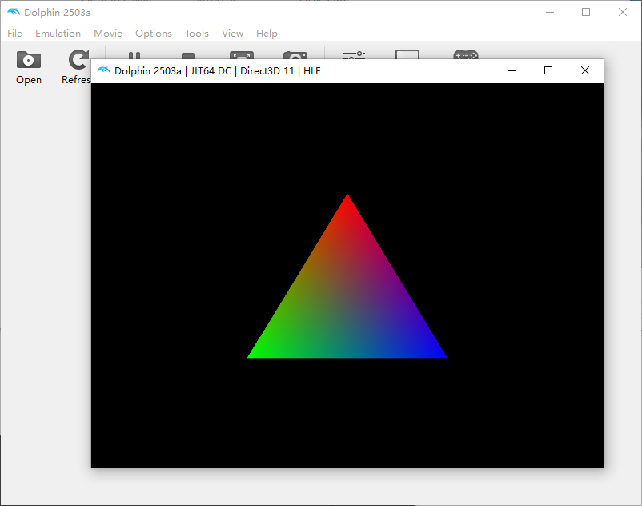

# Wii_helloworld

A basic wii app

# config devkitPro

1. Just follow https://devkitpro.org/wiki/Getting_Started
2. (windows only) run devkitPro msys2

# Referencs

- https://devkitpro.org/wiki/Getting_Started
- https://github.com/devkitPro/wii-examples
- [dolphin-emu](https://dolphin-emu.org/)
